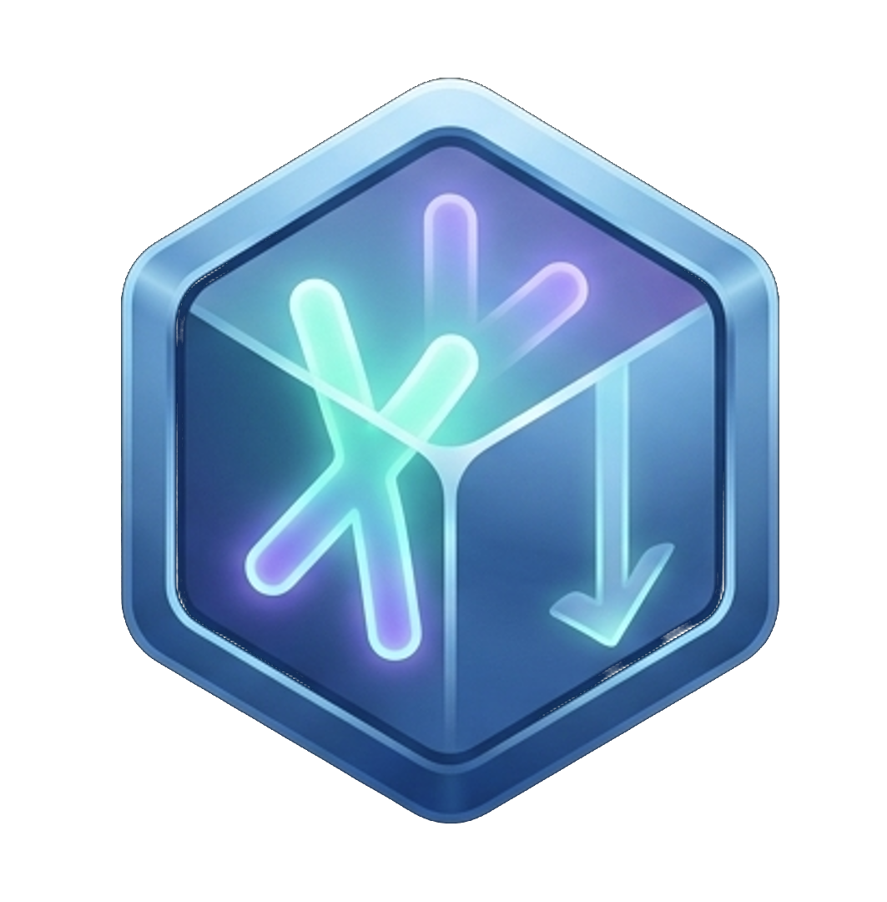

# Deploid

<center>

</center>

## Cross platform(!) Installation Wizard creator
<center>


</center>


### Building

Run command
```sh
make all BUILD=release
```

## Running

Run command

```sh
Usage: deploid.exe [OPTIONS] --source <FOLDER>

Options:
  -s, --source <FOLDER>  Source folder where installation files lie.
  -o, --output <PATH>    the output file path [default: .\install.exe]
  -h, --help             Print help
  -V, --version          Print version
```
Example:
```sh
deploid --source ./package --output ./install-my-app
```
## Package strcture
```
package
 |- main.rhai
 |- LICENSE
 |- <other files>
```

## Example script
```rhai
/* The metadata bag the contains the configurations
 * that will be used by the script to be used by the engine
 * or used by this script to be used in different places
 * and branching
 */
fn get_metadata(config) {
    config += #{
        app_name: "Test",
        path: "C:\\Program Files\\TestDeploid\\" ,
        license: load_text_from_file("LICENSE"),
    };
    print(config)
}


/* This function controls the sequence and order of the
 * wizard steps from start to finish, this is called before
 * each step to route the wizard to the proper steps based on
 * configuration
 */
fn next_action(config, action) {

    switch(action.enum_type) {
        "builtin_init"      => Step::Welcome,
        "builtin_welcome"   => Step::License,
        "builtin_license"   => Step::Path,
        "builtin_path"      => Step::Confirm,
        "builtin_confirm"   => Step::CopyFiles,
        "builtin_copyfiles" => Step::Finish
    }
}

/* this is the actual installation script steps
 * this can be controlled by the config that are filled
 * throughout the wizard steps, this function is exactly
 * called in the start of the copy files step
 */
fn installation_actions(config) {
    InstallAction::CopyDir("folder1","folder1")
    + InstallAction::CopyDir("folder2","dir2")
    + [
        InstallAction::CopyFile("app.exe"),
        InstallAction::CopyFile("LICENSE"),
        InstallAction::CopyFile("README.md"),
    ];

}

```

## Further Work
- [x] Mininal Viable Product
- [ ] Add uninstall template app
- [ ] Restructure code
- [ ] Add Yes/No step
- [ ] Add Selection step
- [ ] Add Browse functionality to path
- [ ] Add Windows Registry manipulation steps
- [ ] Add shortcusts to App menus
- [ ] Add package validation in builder
- [ ] Add cancel actions in copy files step
- [ ] Add support egui backend GUI
